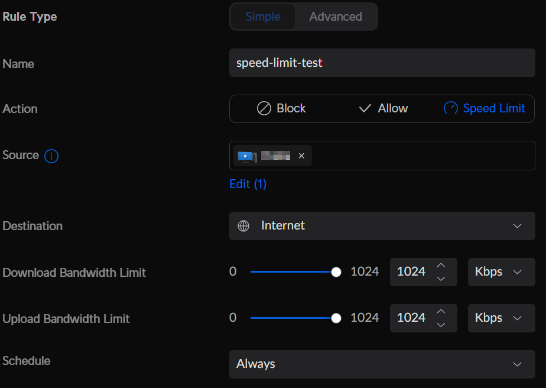

# UniFi LTE speed limiter
Automatically toggle a traffic rule when LTE failover is active to avoid unnecessary traffic

## Setup
* install nodejs and `npm install`
* rename `default.env` to `.env`
* update `.env` with your unifi host+port  


* create a new UniFi OS user (https://unifi/admins)
  * can be local-access-only
  * needs the `Site Admin` role
* update `.env` with the username+password


* create a new Traffic Rule (https://unifi/network/default/settings/security/firewall-rules)
  * set it to `Speed Limit` or `Block`
    * depending on if you want to completely block internet access while on LTE or just limit the speed
  * choose the device(s) or network(s) you want to limit


* after saving the new rule, click on it to edit and copy the rule ID from the address bar
* change `LIMIT_TRAFFIC_RULE_ID` in `.env` to that ID


* open the device info of your U-LTE and copy the MAC address
* update `.env` with the MAC


## Usage
just run `run.sh`, `node index.js` or `npm run start`  

it will check if the U-LTE is in failover mode, and then enable/disable the traffic rule accordingly


### Run automatically
setup a crontab to run `node index.js` or `run.sh` on whatever interval you like
```
5 * * * * cd /home/user/unifi-lte-limiter && /bin/node index.js
```